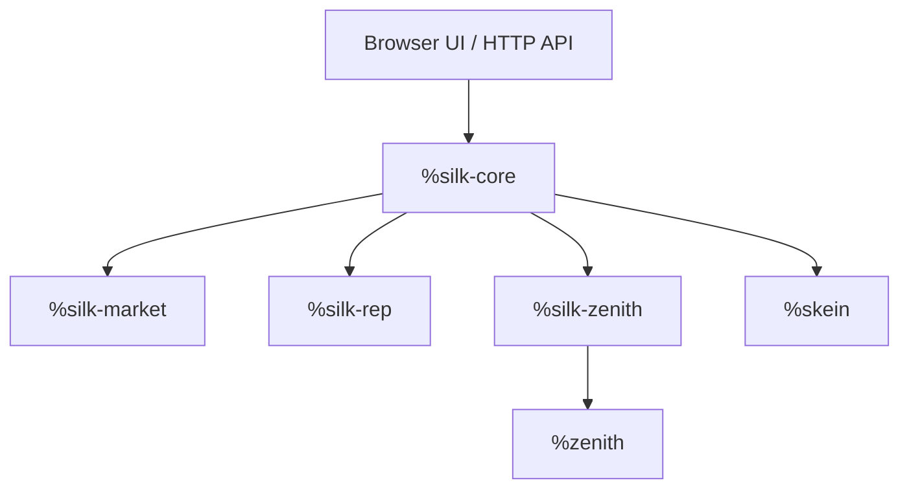
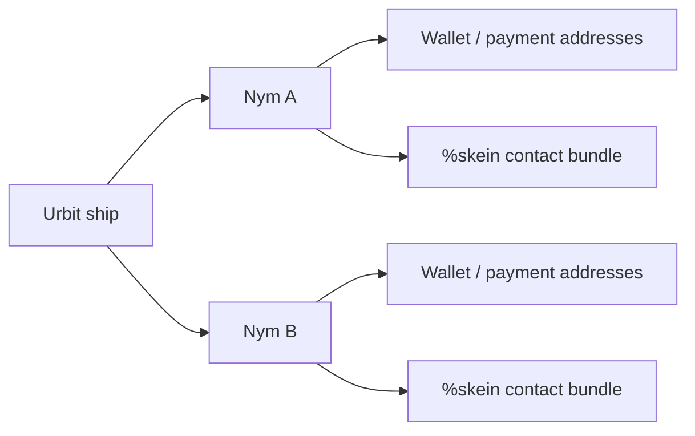
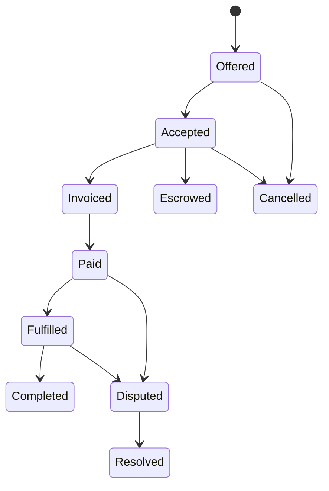
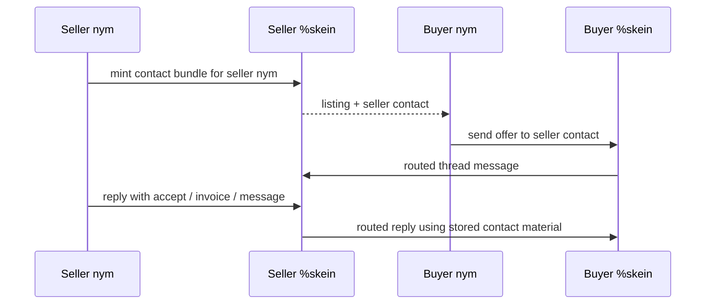
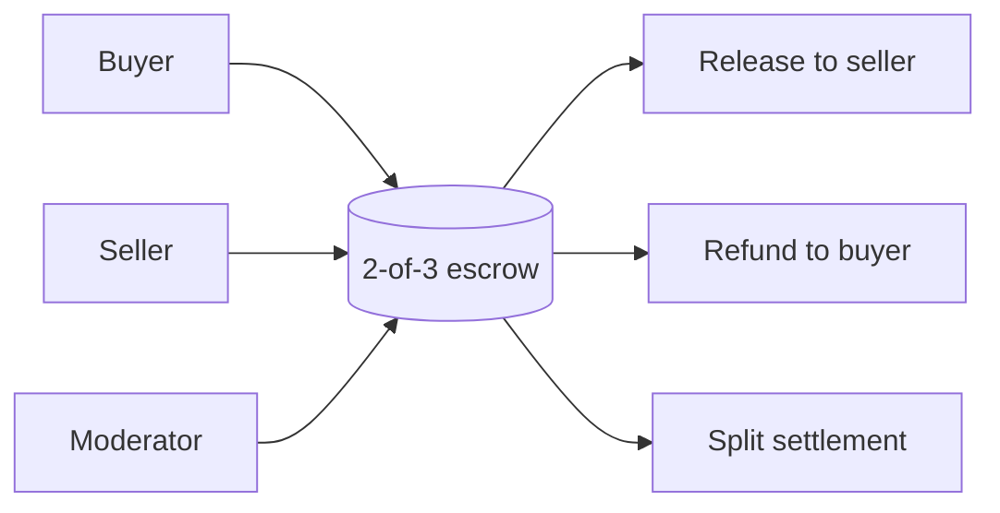

# %silk

`%silk` is a marketplace protocol for Urbit built on top of `%skein`.

Its job is to let people discover listings, negotiate, buy, sell, dispute, and build reputation through pseudonymous market identities rather than ordinary ship-to-ship application messaging. `%skein` handles routed delivery, `%silk` defines what the marketplace messages mean, and Zenith provides the settlement rail.

The project is aimed at a simple idea: a participant should be able to show up as a market identity, not as an Urbit ship, and still take part in a functioning marketplace.

## What `%silk` is trying to provide

At a high level, `%silk` is a commerce layer with five major pieces:

- pseudonymous identities for buyers, sellers, and moderators
- listing and catalog exchange
- negotiation threads that carry the full order conversation
- optional moderator escrow for higher-trust trades
- attestations and reputation after a trade completes

The design is intentionally layered. `%silk` is not its own transport and it is not its own blockchain.

- `%silk-core` handles identities, contacts, listings, threads, escrow orchestration, and the user-facing API
- `%silk-market` is the marketplace state machine
- `%silk-rep` stores marketplace reputation data
- `%silk-zenith` connects Silk's payment and escrow workflow to Zenith

## The identity model

`%silk` is built around the idea that a marketplace needs different kinds of identity for different jobs.

- `ship`: the Urbit machine identity
- `nym`: the market-facing pseudonym
- `wallet`: the payment identity used on Zenith

A participant may have many nyms. A nym signs marketplace messages, owns listings, appears in threads, and can act as a moderator. Transport reachability is carried through `%skein` contact bundles rather than ordinary raw routes.

The point of this split is conceptual as much as technical: the name you trade under should not need to be the same thing as the transport identity that keeps your node online.

## Listings, catalogs, and discovery

`%silk` treats the marketplace as a distributed catalog rather than a central storefront.

- sellers publish listings under a nym
- peers exchange listing catalogs
- contact bundles travel with those catalogs so future thread traffic can stay on the routed `%skein` layer
- marketplace peers can be learned gradually through the network rather than from one fixed central index

That means discovery is a peer-to-peer process. The system is trying to make "who is selling what?" a sync problem rather than a platform problem.

## Threads are the center of the protocol

Every trade in `%silk` lives inside a thread.

A thread is the durable conversation between participants. It is the place where offers, acceptances, invoices, payment proofs, fulfillment notes, disputes, verdicts, and direct messages all accumulate. If you want to understand the state of an order, you read the thread.

This choice is deliberate. Commerce is not just a series of isolated state transitions; it is a structured conversation with receipts, counteroffers, commitments, and exceptions. `%silk` keeps that conversation visible and durable.

## A typical order flow

A simple direct-payment trade looks like this:

1. a buyer discovers a listing
2. the buyer opens a thread with an offer or direct message
3. the seller accepts and issues an invoice
4. the buyer submits payment proof
5. the seller fulfills
6. both sides complete and later attach attestations or feedback

The same thread structure also supports cancellation, rejection, and dispute handling.

## How messaging works without ordinary app pokes

`%silk` relies on `%skein` for the transport boundary.

Instead of saying "send this to `[ship app]`," Silk usually says "send this to the contact bundle associated with this market identity." That keeps the marketplace protocol focused on nyms and contacts rather than direct ship addressing.

The mechanism matters because it changes what a counterparty needs in order to interact with you. They need the market-facing contact material, not your raw ship route as part of the application protocol.

## Escrow and moderators

Not every trade needs escrow, but Silk treats escrow as a first-class marketplace feature rather than an afterthought.

The escrow model is a 2-of-3 arrangement among:

- buyer
- seller
- moderator

The moderator is there to break deadlocks and adjudicate disputes. In the happy path, buyer and seller can complete without moderator intervention. In the unhappy path, the moderator can review evidence and help drive release, refund, or split settlement.

The design logic is straightforward:

- direct trades are convenient
- higher-risk trades need a dispute mechanism
- disputes should be resolved by a specific market role rather than by trusting one counterparty to behave well after the fact

## Reputation and attestations

A marketplace needs memory.

`%silk` includes signed attestations and reputation storage so that completed trades can leave behind a usable record. Reputation is meant to emerge from trade history, fulfillment behavior, payment behavior, and dispute outcomes rather than from one central scorekeeper.

That is why `%silk` includes a separate `%silk-rep` layer: reputation is part of the market protocol, but it is not the same thing as transport, thread delivery, or settlement.

## Privacy model

The privacy idea in `%silk` is not "hide everything everywhere." The idea is narrower and more practical:

- counterparties should interact through nyms
- delivery should run through routed `%skein` contacts
- payment identity should be separate from market identity
- moderator and catalog mechanics should live at the marketplace layer rather than direct ship-to-ship app pokes

This is why `%silk` is built on `%skein` at all. The marketplace protocol is trying to present the user as a pseudonymous market actor instead of exposing the transport layer as the natural identity boundary.

## What a participant sees

From a user perspective, `%silk` is a marketplace app with these major surfaces:

- nyms
- listings
- threads
- orders
- moderators
- escrow state
- reputation and attestations
- peer and catalog discovery

The browser UI lives in `ui/` and talks to the HTTP API served by `%silk-core`.

## Relationship to `%skein`

`%silk` should be read as an application protocol over `%skein`, not as a replacement for `%skein`.

- `%skein` answers: how does a message get there?
- `%silk` answers: what does the message mean for a marketplace?

That separation is the heart of the design. The transport layer handles routed delivery and reachability; the marketplace layer handles identities, listings, negotiation, escrow, and reputation.
